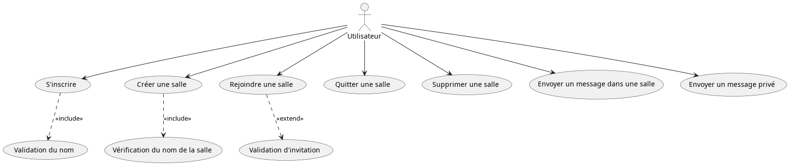
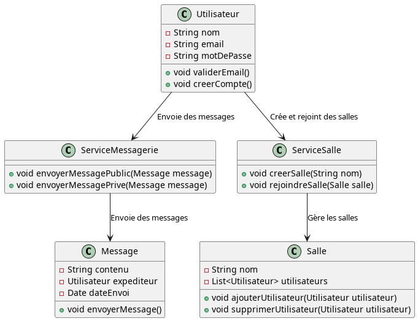
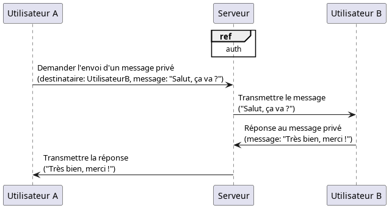
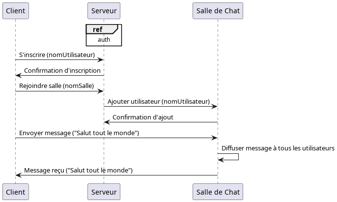
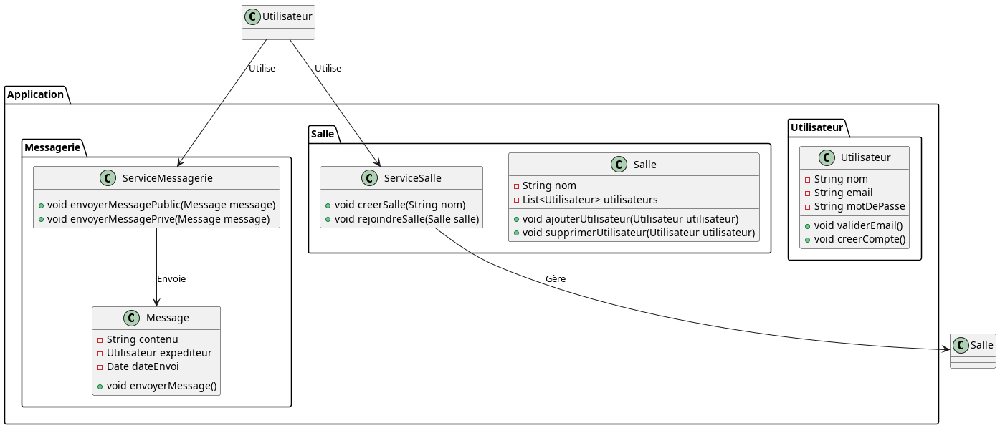
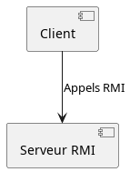
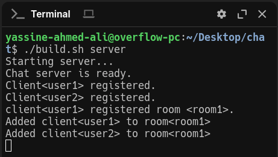
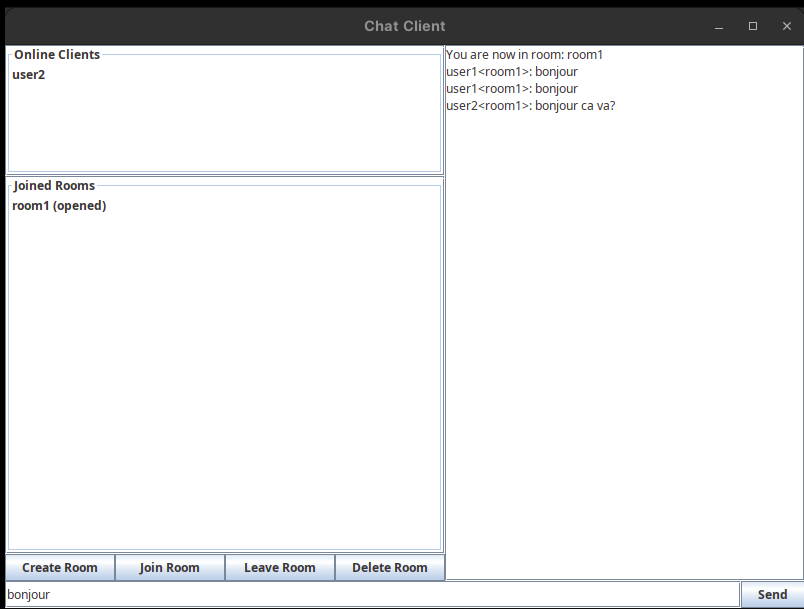
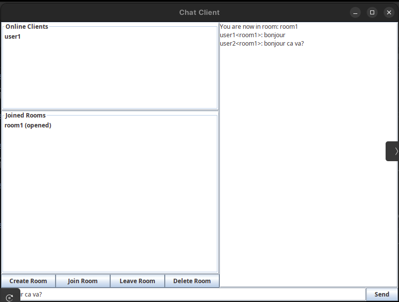

# **Application de Chat Room avec RMI**

**Titre :** Application de Chat Room avec RMI  

**Auteur :** Mohamed Yassine Ahmed Ali

**Matière :** Architecture Client/Serveur  

**Description :**  
Ce document détaille l'architecture UML, les composants, et le fonctionnement d'une application de chat basée sur la technologie RMI. 
Il inclut des diagrammes explicatifs pour les cas d'utilisation, les classes, les séquences, les packages, et les composants.

---

## **Table des Matières**

1. Diagramme de Cas d'Utilisation  
2. Diagramme de Classes  
3. Diagramme de Séquence : Messages Privés  
4. Diagramme de Séquence : Messages dans une Salle  
5. Diagramme de Packages  
6. Diagramme de Composants  
7. Fonctionnalités  
8. Défis et Solutions  
9. Fonctionnement  
10. Conclusion  

---

## **1. Diagramme de Cas d'Utilisation**

Le diagramme de cas d’utilisation décrit les principales interactions entre un **utilisateur** et le système. Les cas d’utilisation majeurs incluent :

1. **S'inscrire** : L'utilisateur fournit des informations pour créer un compte. Une validation du nom est effectuée pour s'assurer qu'il est unique.  
2. **Créer une salle** : L'utilisateur peut créer une nouvelle salle de chat. Une vérification du nom de la salle garantit son unicité.  
3. **Rejoindre une salle** : Permet à l'utilisateur de rejoindre une salle existante, avec une validation de l'invitation pour restreindre l'accès.  
4. **Quitter une salle** : L'utilisateur peut quitter une salle à tout moment.  
5. **Supprimer une salle** : Si l'utilisateur est le créateur de la salle, il peut la supprimer.  
6. **Envoyer un message dans une salle** : Les utilisateurs peuvent communiquer dans une salle publique.  
7. **Envoyer un message privé** : Les utilisateurs peuvent échanger des messages privés.  

---

## **2. Diagramme de Classes**

Le diagramme de classes représente les entités principales de l’application et leurs relations.

1. **Utilisateur** :  
   - Attributs : nom, email, mot de passe.  
   - Méthodes : validation de l’email et création de compte.  

2. **Salle** :  
   - Attributs : nom, liste des utilisateurs.  
   - Méthodes : ajouter ou supprimer un utilisateur.  

3. **Message** :  
   - Attributs : contenu, expéditeur, date d’envoi.  
   - Méthodes : envoyer un message.  

4. **ServiceMessagerie** :  
   - Méthodes : envoi de messages publics ou privés.  

5. **ServiceSalle** :  
   - Méthodes : créer une salle et permettre aux utilisateurs de la rejoindre.  

---

## **3. Diagramme de Séquence : Messages Privés**

Ce diagramme montre comment un utilisateur envoie un message privé à un autre utilisateur à travers le serveur RMI.

1. **Utilisateur A** :  
   - Envoie une requête au serveur pour transmettre un message privé à un destinataire (Utilisateur B).  

2. **Serveur RMI** :  
   - Reçoit la requête d'Utilisateur A.  
   - Transmet le message à Utilisateur B.  

3. **Utilisateur B** :  
   - Reçoit le message et peut répondre en envoyant un message privé à son tour.  
   - La réponse est transmise par le serveur à Utilisateur A.  

---

## **4. Diagramme de Séquence : Messages dans une Salle**

Ce diagramme illustre le processus de communication dans une salle de chat :

1. **Inscription** :  
   - Un client s'inscrit auprès du serveur RMI en fournissant un nom d'utilisateur.  
   - Le serveur confirme l'inscription.  

2. **Rejoindre une salle** :  
   - Le client demande à rejoindre une salle en précisant son nom.  
   - Le serveur ajoute l'utilisateur à la salle et confirme l'ajout.  

3. **Envoyer un message** :  
   - Le client envoie un message dans la salle.  
   - La salle diffuse le message à tous les utilisateurs connectés.  

---

## **5. Diagramme de Packages**

Le diagramme de packages montre l'organisation des classes dans des modules distincts :

1. **Package Utilisateur** :  
   - Contient la classe `Utilisateur` (gestion des informations utilisateur).  

2. **Package Messagerie** :  
   - Contient la classe `Message` (gestion des données des messages) et `ServiceMessagerie` (envoi des messages publics et privés).  

3. **Package Salle** :  
   - Contient la classe `Salle` (gestion des utilisateurs dans une salle) et `ServiceSalle` (création et administration des salles).  

---

## **6. Diagramme de Composants**

Le diagramme de composants illustre les modules principaux et leurs interactions :

1. **Client** :  
   - Interagit avec le serveur via des appels RMI.  

2. **Serveur RMI** :  
   - Gère les requêtes du client.  

Les communications sont organisées comme suit :  
- Le client envoie des requêtes au serveur.  
- Le serveur effectue les actions nécessaires.  

---

## **7. Fonctionnalités**

Les fonctionnalités principales de l'application incluent :

1. **Gestion des utilisateurs** :  
   - Inscription et authentification des utilisateurs.  
   - Validation des identifiants uniques.  

2. **Gestion des salles** :  
   - Création et suppression des salles de chat.  
   - Rejoindre et quitter des salles existantes.  

3. **Messagerie** :  
   - Envoi de messages publics dans des salles.  
   - Envoi de messages privés entre utilisateurs.  
   - Diffusion automatique des messages aux utilisateurs connectés.  

4. **Fiabilité** :  
   - Gestion des erreurs pour les utilisateurs et les salles (utilisateurs non valides, salles inexistantes, etc.).  

---

## **8. Défis et Solutions**

### **Défis**  

1. **Synchronisation des messages** :  
   - S'assurer que tous les utilisateurs reçoivent les messages en temps réel.  

2. **Sécurité** :  
   - Protéger les données utilisateur et les communications.  

### **Solutions**  

1. Utilisation de threads pour gérer les connexions et les échanges en parallèle.  

2. Intégration de mécanismes d'authentification.

---

## **9. Fonctionnement**

### **Serveur**  

### **Clients**  
Les deux clients communiquent dans la salle "room1" :  
  
  

---

## **10. Conclusion**

Cette documentation offre une vue complète de l'architecture d'une application de chat basée sur RMI. Elle met en avant une conception modulaire, une répartition claire des responsabilités entre les composants, et une gestion efficace des interactions client-serveur.  
Les fonctionnalités et les solutions proposées garantissent un système robuste, évolutif et adapté aux besoins d'une application de messagerie moderne.

---